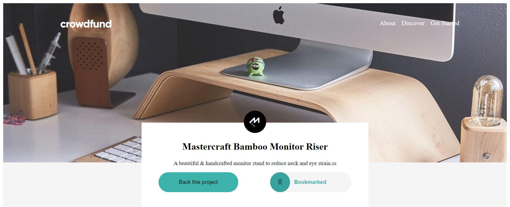

# crowdfund-
# Frontend Mentor - Crowdfunding product page solution
This is a solution to the [Crowdfunding product page challenge on Frontend Mentor](https://www.frontendmentor.io/challenges/crowdfunding-product-page-7uvcZe7ZR). Frontend Mentor challenges help you improve your coding skills by building realistic projects. 

## Table of contents

- [Overview](#overview)
  - [The challenge](#the-challenge)
  - [Screenshot](#screenshot)
  - [Links](#links)
- [My process](#my-process)
  - [Built with](#built-with)
  - [What I learned](#what-i-learned)
  - [Continued development](#continued-development)
  - [Useful resources](#useful-resources)
- [Author](#author)


## Overview

### The challenge

Users should be able to:

- View the optimal layout depending on their device's screen size
- See hover states for interactive elements
- Make a selection of which pledge to make
- See an updated progress bar and total money raised based on their pledge total after confirming a pledge
- See the number of total backers increment by one after confirming a pledge
- Toggle whether or not the product is bookmarked

### Screenshot




### Links

- Solution URL: [ solution URL ](https://github.com/lamba01/crowdfund-)
- Live Site URL: [ live site URL ](https://crowdfundpro.netlify.app/)

## My process

### Built with

- Semantic HTML5 markup
- CSS custom properties
- Flexbox
- JavaScript


### What I learned


```js

 function submit() {
    if(first.value.trim().length === 0){
        window.alert('Enter a value!')
    }else if(first.checkValidity() == true){
        jail.style.display = 'block'
        content.style.display = 'none'
        first.value = null
        let amountleft = document.getElementsByName('amountleft1')
        for (let i = 0; i < amountleft.length; i++) {
            var a = amountleft[i].value;
            a--
            amountleft[i].value = a
        }
    }
    else {
        window.alert('Enter a valid value!')
    } 
}
```


## Author

- Frontend Mentor - [@yourusername](https://www.frontendmentor.io/profile/lamba01)
- Twitter - [@yourusername](https://www.twitter.com/lambacodes)


